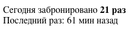

# fake bookingCounter
Плагин для создания иллюзии подсчета последних заказов, как на booking.com   
Использует localStorage, по этому счетчик корректно работает даже при очистке cookie. 




```

<div class="counter"></div>

<script src="./src/fakeCounter.js"></script>
<script>
    var options = {
        // Диапазон для генерации кол-ва заказов
        countMin: 4,
        countMax: 21,

        // С какой периодичностью обновлять и в каком диапазоне
        updateInterval: 1, //min
        incrementMin: 1,
        incrementMax: 4,
        
        // Когда посл.раз заказали
        lastOrderMin: 5,    //min
        lastOrderMax: 60    //min
    }
    var counter = new bookingCounter('.counter', options);        
</script>


```